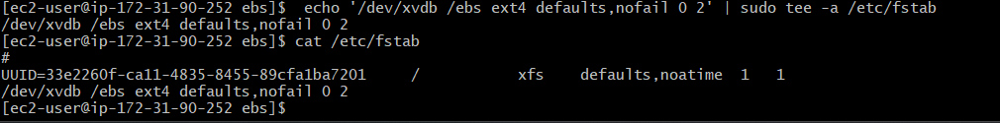

Step 1: Create and Attach an EBS Volume

1. **Log in to the AWS Management Console** and navigate to the EC2 dashboard.

2. **Create an EBS Volume:**
   - Go to "Volumes" in the left sidebar.
   - Click "Create Volume."
   - Choose a type (e.g., General Purpose SSD), specify size, and select the same availability zone as your EC2 instance.
   - Click "Create Volume."
   
   

3. **Attach the EBS Volume to an EC2 Instance:**
   - Right-click the newly created volume and select "Attach Volume."
   - Choose the instance from the list and click "Attach."
   

4. **Log into your EC2 instance via SSH.**
   ```bash
   ssh -i your-key.pem ec2-user@your-instance-public-dns
   ```

5. **Format and mount the EBS volume:**
   - Check available disks:
     ```bash
     lsblk
     ```
   - Format the volume (replace `/dev/xvdf` with your volume device):
     ```bash
     sudo mkfs -t ext4 /dev/xvdf
     ```
   - Create a mount point and mount the volume:
     ```bash
     sudo mkdir /mnt/mydata
     sudo mount /dev/xvdf /mnt/mydata
     ```
     

6. **Ensure the volume is mounted on reboot:**
   - Add to `/etc/fstab`:
     ```bash
     echo '/dev/xvdf /mnt/mydata ext4 defaults,nofail 0 2' | sudo tee -a /etc/fstab
     ```
     
     
